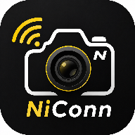

<p align="center">
  
</p>

# NiConn_DEMO

尼康 Z50II 无线控制 Android 演示应用（第三方独立实现）。

通过相机「连接至智能设备」+ STA 模式（相机连接手机热点），使用 PTP/IP 无线协议完成发现、配对、连接、实时取景、参数调节与相册管理。**不使用尼康官方 SDK、不依赖 SnapBridge**。

## 功能

- **连接引导**：三步引导（手机热点 → 相机 STA 配对 → 发现连接），自动配对码确认，最近连接保存与快速重连
- **设置抽屉**：点击连接页「NiConn」标题从左侧滑出（iOS 风格），可调取景帧率（省电/均衡/流畅）、默认横屏、屏幕常亮、相册缩略图列数，附版本与许可信息
- **实时取景**：约 10fps 无线取景；点按对焦（单点 AF 区域模式 + 绿色对焦框）；快门拍摄；ISO / 快门速度 / 光圈按相机实际支持值调节；横屏模式
- **相册**：缩略图网格（JPEG/NEF 角标）、大图查看（EXIF 自动旋转、双指缩放）、照片详细信息（文件名、大小、分辨率、ISO、快门、光圈、焦距、拍摄日期）、删除、长按多选批量下载

## 技术栈

- Kotlin + Jetpack Compose（Material3）
- 协程（Coroutines / Flow）
- PTP/IP over Wi-Fi：mDNS（`_ptp._tcp`）发现 + TCP 15740 私有帧协议
- 单元测试：JUnit4 + Mock 相机服务器
- minSdk 26（Android 8.0+）/ targetSdk 36

协议细节（帧格式、配对码、LiveView、相册命令等）见 [docs/PROTOCOL.md](docs/PROTOCOL.md)。

## 已编译 APK

- 文件：[release/NiConn_Demo-v0.1.0.apk](release/NiConn_Demo-v0.1.0.apk)
- 版本：**v0.1.0**（versionCode 1，debug 签名）
- 构建日期：2026-08-06
- 安装：允许「安装未知来源应用」，或 `adb install -r release/NiConn_Demo-v0.1.0.apk`

## 编译

环境要求：JDK 17+、Android SDK（compileSdk 36）、Android Studio 或命令行 Gradle。

```bash
./gradlew :app:assembleDebug
# 产物：app/build/outputs/apk/debug/app-debug.apk（文件名 = 模块名 app + 构建类型 debug）
```

执行 `./gradlew :app:assembleRelease` 会生成 `app-release.apk`（未配置签名时使用 debug 签名）。仓库提供的演示包已重命名为 `NiConn_Demo-v0.1.0.apk`。

安装到手机：

```bash
adb install -r app/build/outputs/apk/debug/app-debug.apk
```

运行单元测试：

```bash
./gradlew :app:testDebugUnitTest
```

## 使用步骤

1. 手机开启移动热点（SSID 不要用中文）。
2. 相机：网络菜单 → 连接至智能设备 → Wi-Fi 连接 (STA 模式) → 创建配置文件并连接热点，停留在配对界面。
3. App：点击「开始发现」→ 选择相机 → 配对成功后在相机上按 OK → 点击「重新连接」。
4. 连接成功后进入「实时取景」或「相册」。

## 兼容性

- 实测：尼康 Z50II（固件 C 1.02），小米 15（HyperOS 3.0.303.0）
- 理论上兼容 Expeed 7 系列机型，未逐一验证

## 未完善功能

- **照片文件名解析**：ObjectInfo 中的文件名字段在不同文件上可能解析不完整（乱码或缺失字符），目前详细信息面板有 `IMG_编号` 兜底。
- **实时取景点按对焦坐标**：在 Z50II 上点按位置与相机实际对焦点仍不能完全对应，需要进一步开发校准；其他机型同样需要重新校准。

## 法律与合规声明

- 本项目是独立实现的第三方兼容工具，与 Nikon Corporation 无隶属、合作、授权或认可关系。
- 本项目为独立实现的第三方兼容工具，**不包含**尼康官方软件（SnapBridge / WTU 等）的任何代码或二进制文件。
- 「Nikon」「SnapBridge」等商标仅用于兼容性描述。

## 开源许可

本项目采用 [PolyForm Noncommercial License 1.0.0](LICENSE)。

- ✅ 允许：学习、研究、二次开发、修改，以及非商业目的的分发
- ❌ 严禁：任何形式的商业使用（包括收费分发、商业产品/服务集成等）
- 分发时必须保留本许可声明与版权声明
